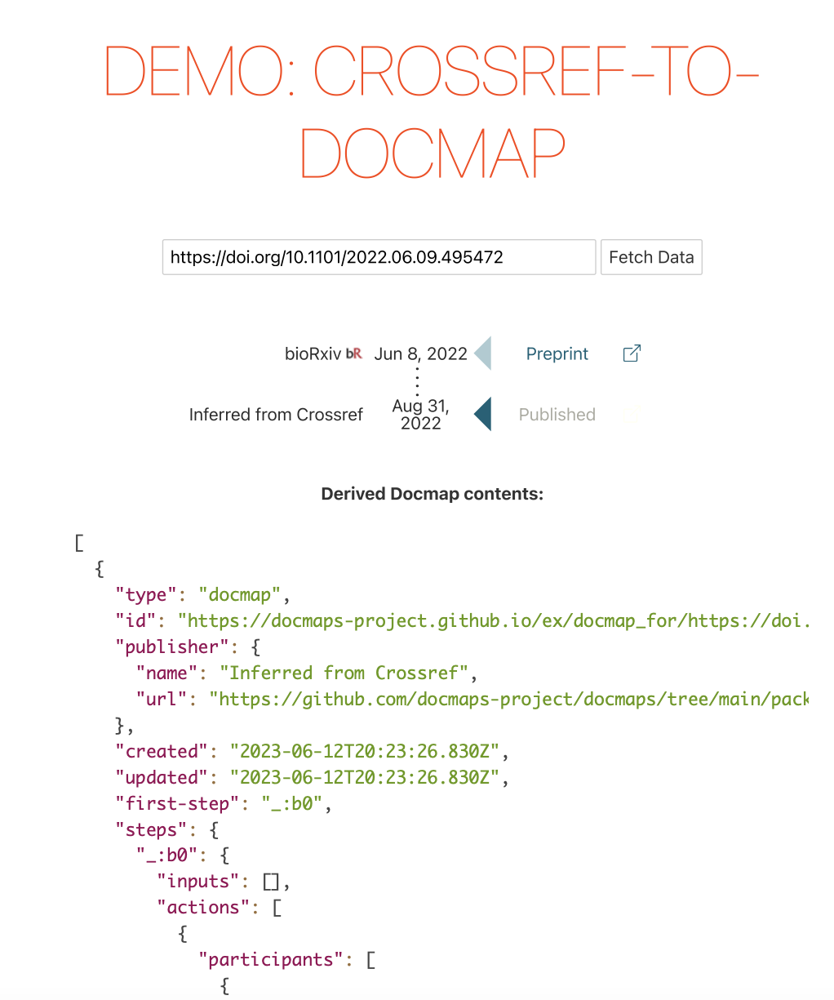

Docmap Visual Playground

This Docmap visualizer is a simple stateless single-page web app that allows you to visualize a docmap based on our Crossref-to-Docmap ETL library. You can plug in any DOI, and if Crossref knows about it and it has reviews or a preprint, you'll get some interesting content back.

## Demo

You can try the live demo hosted on GitHub Pages [here](https://docmaps-project.github.io/docmaps).

### Screenshots





## Getting Started for Development

### Prerequisites

- Node.js (>= 12.x)
- pnpm package manager

### Installation

1. Clone the repository:

```bash
git clone https://github.com/docmaps-project/docmaps
cd docmaps/packages/spa
```

2. Install dependencies:

```bash
pnpm install
```

### Running the tests

To run tests:

```bash
pnpm test
```

Note that you need an installation of Chrome, and must set
the `CHROME_PATH` variable. If you use Chromium, it might be something like
`/usr/local/bin/chromium`.

### Running the App

To start the development server:

```bash
pnpm run dev
```

Then navigate to `http://localhost:8080` in your browser.

### Deploying to GH Pages

The Github Pages is deployed from the `gh-pages` workflow in repository root. This workflow is called
by the `release` workflow and is only triggered on merge to main. It first builds/bundles this package,
then deploys the bundle. Note that because the repo name disagrees with the package name, the `index.html`
is modified to use relative paths for all bundled resources.

## Built With

- [Svelte](https://svelte.dev/) - The web framework used
- [render-rev](github.com/source-data/render-rev) - Display component built by EMBO
- [pnpm](https://pnpm.io/) - The package manager

## Contributing

See the main repository contributing guidelines.

## License

See main repository license.

## Acknowledgments

- [render-rev](github.com/source-data/render-rev)
- [Svelte](https://svelte.dev/)
- [pnpm](https://pnpm.io/)
- [crossref](https://crossref.org/)
