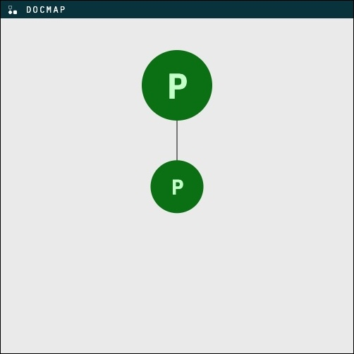
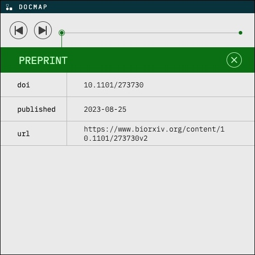

# Official Docmaps Widget
[](https://badge.fury.io/js/@docmaps%2Fwidget)

An embeddable widget for displaying Docmaps data, built with Lit and D3.

To see the widget in action, check out the [Docmap explorer](https://docmaps-project.github.io/docmaps/demo/index.html?doi=10.1101%2F2023.06.01.543271) demo site!

# Usage

The widget can be retrieved via CDN, or via NPM if your project already uses NPM.

## Retrieving via CDN
You can directly pull in the widget in an HTML file without installing anything like so:

```html
<head>
  <script type='module' src='https://cdn.jsdelivr.net/npm/@docmaps/widget@latest/dist/index.min.js'></script>
</head>
<body>
<docmaps-widget doi='doi-to-render' serverurl='https://example.com'></docmaps-widget>
</body>
```

## Installing with NPM
If your project already uses NPM, you can install the widget like so:

```shell
npm install @docmaps/widget
```

Then, add the widget to your page:

```html
<script>
  import '@docmaps/widget';
</script>

<docmaps-widget doi="doi-to-render" serverurl="https://example.com"></docmaps-widget>
```

## Supported attributes
These attributes can be added to the `<docmaps-widget>` tag to configure the widget's behavior.

| Attribute   | Description                                                                                                                                                                                                                                                                                                                                                                                                          |
|-------------|----------------------------------------------------------------------------------------------------------------------------------------------------------------------------------------------------------------------------------------------------------------------------------------------------------------------------------------------------------------------------------------------------------------------|
| `doi`       | The DOI of the paper to render                                                                                                                                                                                                                                                                                                                                                                                       |
| `serverurl` | The URL of the server from which the docmap will be fetched. The widget will make a request to this server's `GET /docmap_for/doi?subject={doi}` endpoint, which must be implemented by the server in accordance with the [official Docmaps API spec](https://github.com/Docmaps-Project/rfcs/blob/ships/1/APIProtocol/proposals/001_interop.md#convenience-endpoints-for-one-shot-noninteractive-docmap-retrieval). |

If you prefer to pass a docmap directly to the widget, you must do so after the widget has been mounted, like so:

```html

<head>
  <script type='module' src='https://cdn.jsdelivr.net/npm/@docmaps/widget@latest/dist/index.min.js'></script>
</head>
<body>
<docmaps-widget id='my-widget'></docmaps-widget>
</body>

<script>
  customElements.whenDefined('docmaps-widget') // wait for the custom docmaps-widget element to be defined
    .then(() => {
      const widgetElement = document.getElementById('my-widget');
      widgetElement.docmap = {
        // docmap here
      };
    });
</script>
```

For examples of docmaps to feed into the widget here, see the [examples directory](../../examples).

# Screenshots

Graph view:



Clicking a node opens the detail view:



# Development

### Running the server locally

```shell
pnpm run dev
```

This starts the server on http://localhost:5173

### Running the tests

The first time you run the tests, you will need to install browsers for Playwright to use

```shell
pnpm run install:browsers
```

#### All tests

```shell
pnpm run test
```

#### Unit tests

```shell
pnpm run test:unit
```

#### Integration tests

To see the tests run in step-by-step, you can open the Playwright UI like this. The Playwright UI is an amazing tool
because it lets you see screenshots of each step of the test, and it automatically reruns the tests when you make
changes.

```shell
pnpm run test:integration:ui
```

Alternatively, you can run the tests headlessly and see results in the terminal:

```shell
pnpm run test:integration
```

By default, the tests only run in chromium locally. To run in chromium, firefox, and webkit, you can run:

```shell
# Headless
pnpm run test:integration:all-browsers

# With UI
pnpm run test:integration:ui:all-browsers
```
